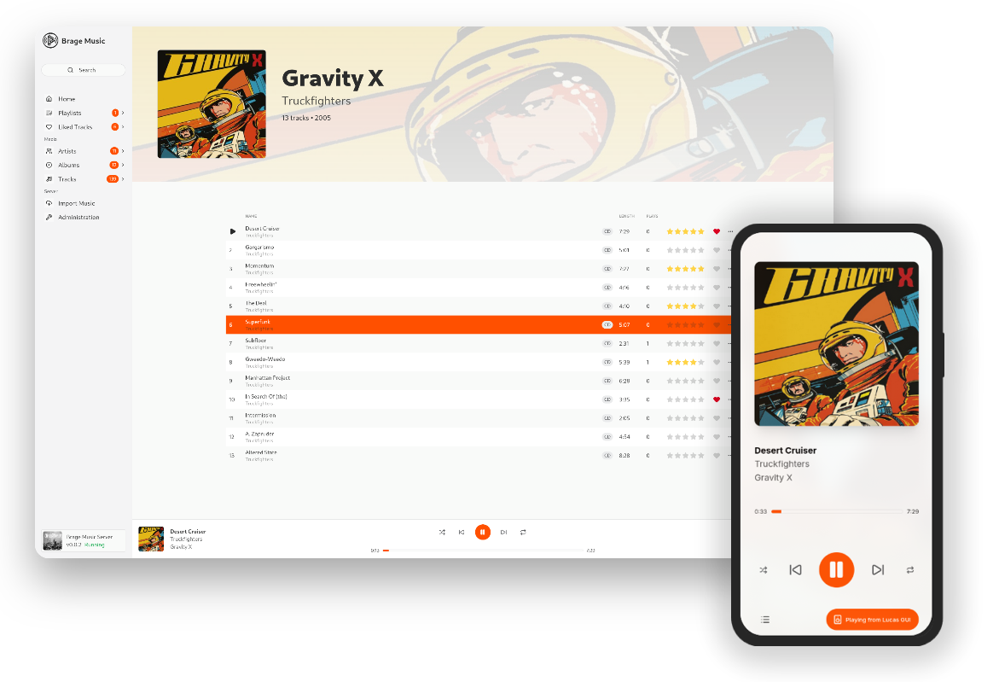

<p align="center">
    
</p>
<h1 align="center">Brage Music</h1>

<p align="center"> 
  <br/>
  <a href="https://opensource.org/license/agpl-v3">
    
  </a>
  <a href="https://https://github.com/bragemusic/bragemusic/releases/latest">
    
  </a>
  <a href="https://https://github.com/bragemusic/bragemusic/releases/latest">
    
  </a>
  <br/>
</p>

<p align="center"> 
  <a href="https://go.dev/">
    
  </a>
  <a href="https://react.dev/">
    
  </a>
  <a href="https://react.dev/">
    
  </a>
  <br/>
  <br/>
</p>

**A self-hosted music library and player.**

Brage Music is an open-source music server and player for people who want to manage and listen to their own music collection.

It is built around a shared core and provides a web interface, desktop application, and server in a single project.

> [!WARNING]
> Brage Music is in early developement and will almost certainly contain bugs. 
> 
 

<p align="center">
    <br/>
    
</p>

## Features

* Manage your personal music library
* Search and browse artists, albums, and tracks
* Play your music from a client and control it from the web
* Desktop application
* Music metadata powered by [MusicBrainz](https://musicbrainz.org/)
* Import and organize music files
* Multi-user library support
* Self-hosted — your music stays yours
* Shared core used across the different Brage Music applications

## Project structure

Brage Music is maintained as a monorepo containing the main components of the project:

| Directory   | Description                          |
| ----------- | ------------------------------------ |
| `cmd/`      | Application entrypoints              |
| `frontend/` | Web frontend                         |
| `pkg/`      | Public Go packages                   |
| `internal/` | Internal server and application code |
| `db/`       | Database migrations                  |
| `docs/`     | Project documentation                |
| `wails/`    | Desktop application integration      |

The same codebase is used to build the server, web application, and desktop client.

## Getting started

See the [documentation](https://bragemusic.app/docs) for installation, configuration, and development instructions.

## Development

Brage Music is primarily written in **Go**, with a **React + TypeScript** frontend.

Clone the repository:

```bash
git clone https://github.com/bragemusic/bragemusic.git
cd bragemusic
```

See the development documentation for the required dependencies and available development commands.

## Status

Brage Music is under active development. Things may change as the project evolves.

## Contributing

Contributions, bug reports, and ideas are welcome.

If you find a bug or have an idea for Brage Music, open an issue. For larger changes, feel free to start a discussion before submitting a pull request.

## License

Brage Music is licensed under the **GNU Affero General Public License v3.0**.

See [LICENSE](LICENSE) for the full license.

---

[Website](https://bragemusic.app/) · [Documentation](https://bragemusic.app/docs)

---

**Own your music. Keep your freedom.**
